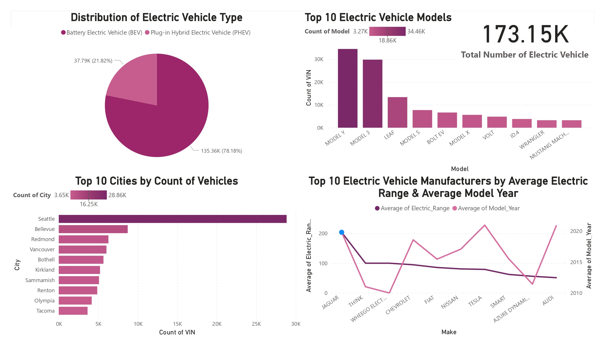

# Data Pipeline from MySQL Database to Microsoft Azure

## Introduction

The project aims to demonstrate a comprehensive data pipeline utilizing Azure services, transitioning raw data from MySQL to actionable insights with Azure Data Factory, Azure Databricks, and Power BI. It showcases loading multiple files efficiently in Azure Data Factory using loops and provides practical application examples using real-world Electric Vehicle Population Data from the Washington State Department of Licensing.

## Architecture 

## Simple Dashboard

## Technology Used
- MySQL
- Python

Microsoft Azure :

1. Azure Data Factory
2. Azure Data Lake Storage Gen2 
3. Azure Databricks
4. Power BI

## Dataset Used
Electric Vehicle Population Data
This dataset shows the Battery Electric Vehicles (BEVs) and Plug-in Hybrid Electric Vehicles (PHEVs) that are currently registered through Washington State Department of Licensing (DOL).

More info about dataset can be found here:
1. Website - https://catalog.data.gov/dataset/electric-vehicle-population-data#sec-dates
2. About Data - https://data.wa.gov/Transportation/Electric-Vehicle-Population-Data/f6w7-q2d2/about_data

## Article About this Project 
Medium Article - https://medium.com/@ahmadkamiludin/end-to-end-data-pipeline-a-simple-guide-to-migrate-from-on-premises-mysql-database-to-microsoft-7266f415d48f